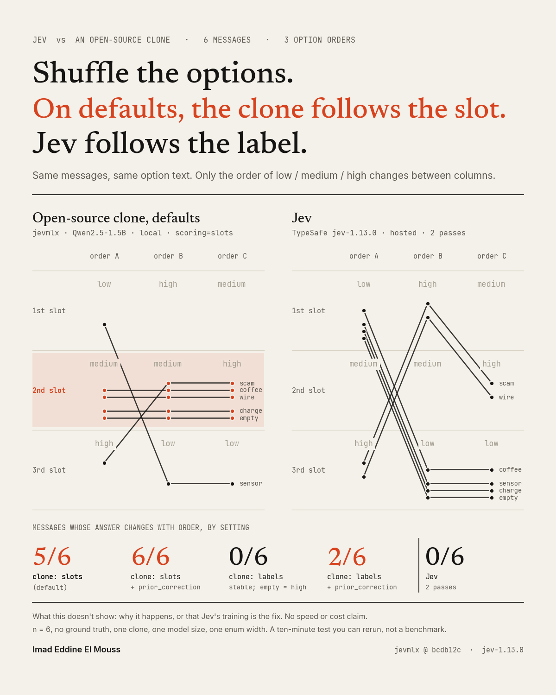

# Reorder the options and a Jev clone changes its answer (on default settings)



I listed the same three options in three different orders and asked the same six questions. On its default settings, jevmlx, an open-source clone of the Jev interface, changed its answer on 5 of 6 messages, and 14 of its 18 answers were whichever option happened to be listed second. Its built-in prior correction made that worse. Switching its scoring mode made it order-stable. Hosted Jev didn't move at all.

## Background

TypeSafe launched Jev on 15 September 2026. You send typed questions over a fixed answer space (boolean, enum, score) plus context, and get what TypeSafe describes as a calibrated probability per field back in one forward pass, instead of generating text and parsing JSON. Within days, open-source clones of the interface appeared. They read logits at constrained answer positions on local open-weight models, with none of TypeSafe's training behind them.

I took one of them, jevmlx (MLX, Qwen2.5-1.5B-Instruct-4bit, fully local), and asked one narrow question: does the answer depend on the order you list your enum options in?

## The test

Six short messages, one 3-option enum field (`risk_tier`: low / medium / high) plus a boolean, run through three orderings of the same options: `[low, medium, high]`, `[high, medium, low]`, `[medium, high, low]`. Same option descriptions every time. Only the position changes, never the meaning. If the chosen tier depends on where an option sits, position is leaking into the decision.

- `clear_high_risk_scam`: a phishing-style urgent message asking for card details
- `benign_smalltalk`: a coffee catch-up message
- `ambiguous_urgent`: a wire transfer request with no verification, urgent tone
- `technical_neutral`: a sensor reading within normal range
- `mild_concern`: an unrecognized $40 charge, plausibly a forgotten subscription
- `empty_string`: literally nothing

## jevmlx on default settings

jevmlx's default `scoring="slots"` lists each option under a neutral code in the prompt and scores the codes.

| case | low/med/high | high/med/low | med/high/low |
|---|---|---|---|
| clear_high_risk_scam | high | medium | high |
| benign_smalltalk | medium | medium | high |
| ambiguous_urgent | medium | medium | high |
| technical_neutral | low | low | low |
| mild_concern | medium | medium | high |
| empty_string | medium | medium | high |

5 of 6 cases change their answer with order alone. 14 of the 18 answers are whichever option is listed second: `medium` in the first two orderings, `high` in the third. That's how a coffee invite and an empty string become "high risk" once `high` moves into slot two.

The clone gives no warning. `benign_smalltalk` lands on `high` with a log-score margin of 1.48 nats over the runner-up, close to the 1.66 to 1.78 it gives the actual scam. A confidence threshold wouldn't catch it.

## jevmlx's own settings

jevmlx ships two relevant switches, so I ran all four combinations on the same pinned commit.

| setting | cases that change with order | answers in slot 1 / 2 / 3 |
|---|---|---|
| `slots` (default) | 5 / 6 | 1 / 14 / 3 |
| `slots` + `prior_correction` | 6 / 6 | 0 / 5 / 13 |
| `labels` | 0 / 6 | 6 / 4 / 8 |
| `labels` + `prior_correction` | 2 / 6 | 6 / 4 / 8 |

`prior_correction` subtracts the model's answer to an empty context. In slots mode it overshoots: the pull moves from slot two to slot three, the scam message comes out `low` in two of three orderings, and half of the 18 margins fall below 0.27 nats.

`scoring="labels"` scores the option text itself, and the order effect is gone on this test: 0 of 6 flips. Stable isn't the same as sensible, though. In labels mode the clone rates `mild_concern` and `empty_string` as `high` in every ordering. Without ground truth I can't call that wrong, but you can judge "an empty message is high risk" yourself.

Full per-case output for every setting is in `results/`.

## Hosted Jev

Each ordering sent twice, because JSON objects are unordered by spec and TypeSafe's docs don't say whether the `criteria` map keeps its order. The repeat shows whether the ordering reaches the model at all. Cells are chosen tier (confidence pass 1 / pass 2).

| case | low/med/high | high/med/low | med/high/low |
|---|---|---|---|
| clear_high_risk_scam | high (1.00 / 1.00) | high (1.00 / 1.00) | high (1.00 / 1.00) |
| benign_smalltalk | low (1.00 / 1.00) | low (0.99 / 0.99) | low (0.99 / 0.99) |
| ambiguous_urgent | high (0.75 / 0.71) | high (0.88 / 0.87) | high (0.84 / 0.87) |
| technical_neutral | low (1.00 / 1.00) | low (1.00 / 1.00) | low (1.00 / 1.00) |
| mild_concern | low (0.60 / 0.67) | low (0.46 / 0.54) | low (0.50 / 0.56) |
| empty_string | low (1.00 / 1.00) | low (0.99 / 0.99) | low (1.00 / 1.00) |

0 of 6 flips in both passes: 36 of 36 answers keep the same label.

The ordering does reach the model. Confidence moves with order more than between identical requests: `ambiguous_urgent` spreads 0.13 to 0.16 across orderings against at most 0.04 between repeats, and is lowest in the original ordering both times. `benign_smalltalk` and `empty_string` repeat exactly yet still differ by 0.01 between orderings. `mild_concern` is the noisiest (0.08 between repeats, 0.13 to 0.14 across orderings). Jev sees the reordering, nudges its confidence, and keeps its answer. It is also not deterministic: identical requests came back up to 0.08 apart.

## What this does and doesn't show

What holds: on this 3-option enum, jevmlx's default scoring gave order-dependent answers on 5 of 6 cases, mostly picking the second-listed option. Its prior correction made it worse. Label scoring removed the order effect here. Hosted Jev was order-stable across two passes.

What it doesn't show:

- No mechanism. The effect appears with slot scoring and not with label scoring, which says where it shows up, not why. It could be a prior on the codes, a tokenization quirk, or a middle-slot bias. Adding option descriptions (so both systems saw the same rubric) didn't remove it; the defaults flipped on one more case with descriptions than without.
- No claim about TypeSafe's training. Model scale, instruction tuning, prompt template and how they handle the criteria map are all live explanations for Jev's stability.
- No latency or cost claim. A local forward pass and a hosted API call aren't comparable that way, so the 40-200x figure is untouched here.
- n = 6, no ground truth, one clone, one model size, one quantization, one enum width. A method demonstration, not a benchmark.

## Take from it what's actually there

Copying the interface was fast. Which readout you wire behind it decides whether option order leaks into the answer, and the default here does. If you run a constrained-decoding wrapper, the test costs ten minutes: reorder your options, rerun, see if the answer moves. Then try the tool's own switches, because the one that sounds like the fix (prior correction) wasn't.

---

## Setup

- Clone: jevmlx from [bnsd55/openjev](https://github.com/bnsd55/openjev) at commit `bcdb12c`, Qwen2.5-1.5B-Instruct-4bit, local on an M4 MacBook via MLX (mlx 0.32.2, mlx_lm 0.31.3). `ordered` flag off; option descriptions are rendered in the prompt. The readout is deterministic, so two runs gave identical output: that confirms reproducibility, not robustness.
- Jev: hosted `jev-latest` alias (responses report `jev-1.13.0`) via TypeSafe's `/v1/systemone` API, run 2026-09-20 14:47 UTC, every ordering sent twice.

## Reproduce

```bash
python3.12 -m venv .venv && source .venv/bin/activate   # or: uv venv --python 3.12

# Clone side (Apple Silicon, Python >= 3.12)
pip install "jevmlx @ git+https://github.com/bnsd55/openjev@bcdb12cb3e3726f1691849bfdb6fb099c15c1933"
python3 clone_jevmlx_position.py                       # library defaults
python3 clone_jevmlx_position.py --prior-correction    # other settings: --scoring labels

# Jev side (needs a TypeSafe API key; the script never prints it)
pip install requests
export TYPESAFE_API_KEY=...
python3 jev_hosted_position.py
```

To test another constrained-decoding wrapper, keep the six cases and option text, change only the order, and see whether the answer moves.

## Files

- `clone_jevmlx_position.py`, `jev_hosted_position.py`: the two tests
- `results/clone-run-1.txt`, `results/clone-run-2.txt`: clone defaults, two runs (identical)
- `results/clone-defaults-fresh.txt`: clone defaults again from a clean install of the pinned commit (identical)
- `results/clone-prior-correction.txt`, `results/clone-labels.txt`, `results/clone-labels-prior.txt`: the other three settings
- `results/jev-run.txt`, `results/exp6_results_20260920T144708Z.json`: raw Jev output, both passes

Not affiliated with TypeSafe or the jevmlx authors. Personal experiment.
